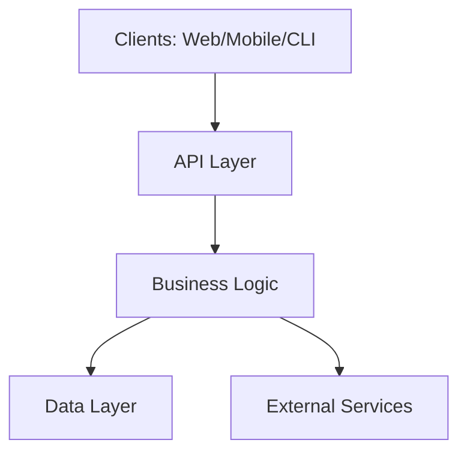
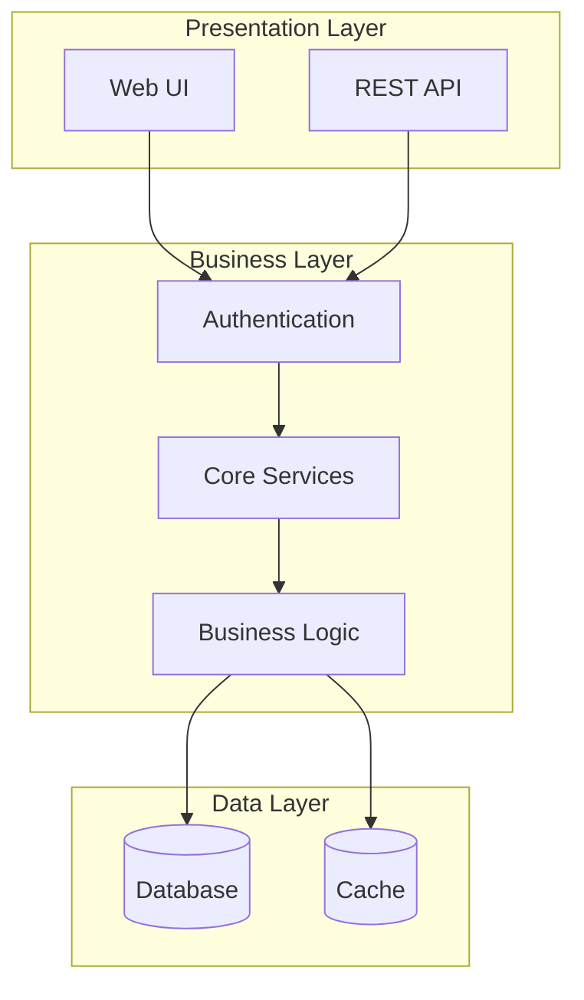
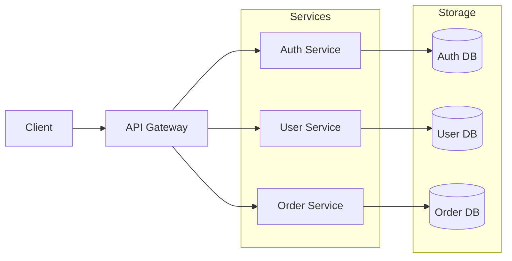
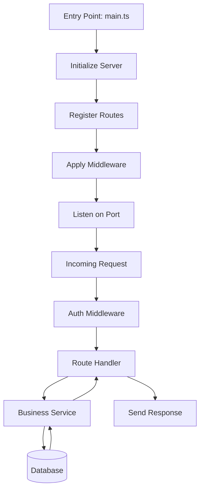
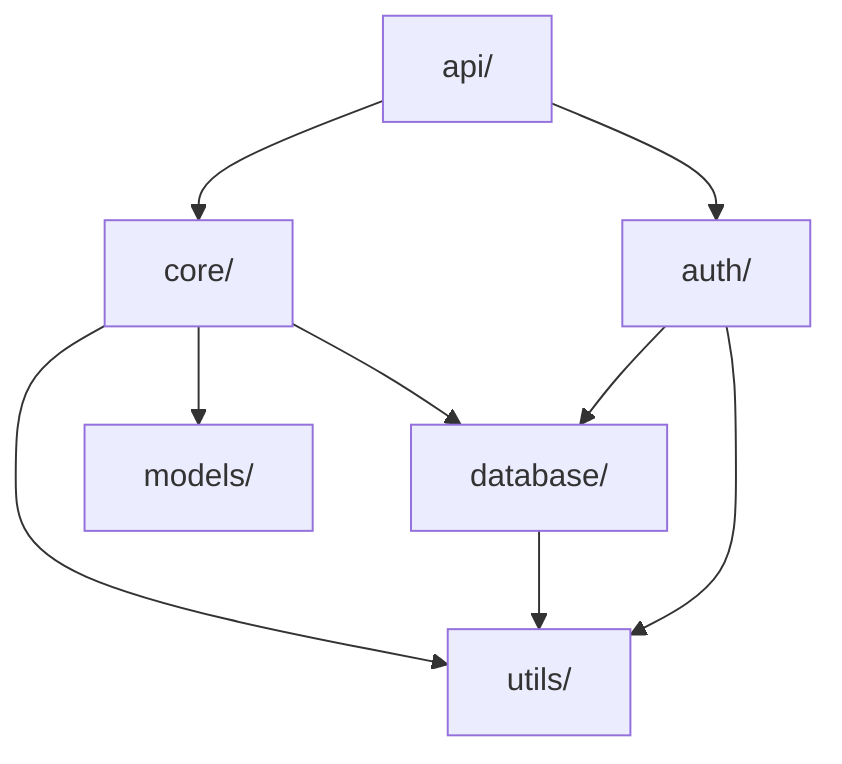

# Codebase Summary: Architecture Documentation and Visualization

A skill for analyzing a codebase and producing comprehensive architecture documentation
for both humans and AI agents. Generates ARCHITECTURE.md files with text descriptions
and Mermaid diagrams showing structure, entry points, APIs, and core modules.

## When to use this skill

- User asks to "summarize the codebase" or "understand the project structure"
- User wants to create or update an ARCHITECTURE.md file
- User says "document the architecture" or "explain how this codebase is organized"
- User is onboarding to a new project and needs a structural overview
- User wants to visualize the codebase with diagrams
- User asks "what are the entry points" or "where does the code start"

---

## Workflow

### Step 1 — Check for Existing Architecture Documentation

Before analyzing from scratch, look for existing documentation that can inform your work.

Use the `Glob` tool to search for architecture documentation:
- Pattern: `**/ARCHITECTURE.md` or `**/architecture.md`
- Also check for: `**/README.md`, `**/docs/architecture/*`, `**/DESIGN.md`

If an ARCHITECTURE.md exists:
- Use `Read` tool to view its contents
- Assess whether it's current and complete
- Ask the user: **"I found an existing ARCHITECTURE.md. Would you like me to:"**
  - Update it with fresh analysis
  - Use it as reference for creating a summary
  - Replace it entirely
  - Just analyze it and provide insights

If no ARCHITECTURE.md exists:
- Proceed to Step 2 to analyze the codebase
- Plan to create a new ARCHITECTURE.md at the repo root

### Step 2 — Discover Codebase Structure and Language

Identify the project type, primary languages, and build system.

Use `Glob` tool to find:
- Configuration files: `package.json`, `pyproject.toml`, `Cargo.toml`, `go.mod`, `pom.xml`, `build.gradle`, `Gemfile`, `composer.json`
- Source directories: `src/`, `lib/`, `app/`, `pkg/`, `internal/`
- Test directories: `test/`, `tests/`, `__tests__/`, `spec/`

Read the main configuration file to understand:
- Project name and description
- Primary language and version
- Key dependencies and frameworks
- Build scripts and commands
- Entry point configurations

Ask the user if needed:
1. **"What type of project is this?"** (web app, library, CLI tool, API service, monorepo, etc.)
2. **"Are there any critical architectural patterns I should highlight?"** (microservices, event-driven, MVC, etc.)
3. **"What level of detail do you want?"** (high-level overview, detailed module breakdown, both)

### Step 3 — Identify Entry Points

Entry points are where code execution begins. These are critical for understanding the codebase.

**For different project types, look for:**

| Project Type | Common Entry Points |
|--------------|-------------------|
| **Node.js/TypeScript** | `index.js`, `server.js`, `app.ts`, `main.ts`, check `package.json` "main" and "bin" fields |
| **Python** | `__main__.py`, `main.py`, `app.py`, `cli.py`, check `pyproject.toml` scripts or `setup.py` entry_points |
| **Go** | `main.go` files, check `cmd/` directory for multiple entry points |
| **Rust** | `main.rs`, `lib.rs`, check `Cargo.toml` [[bin]] sections |
| **Java** | Classes with `public static void main()`, check build config for mainClass |
| **Web Apps** | `index.html`, `App.jsx`, `App.tsx`, `main.jsx` |

Use `Grep` tool to find:
- Pattern: `func main|def main|public static void main|if __name__ == "__main__"`
- File type filters based on detected language

Document:
- Primary entry point (where the app starts)
- Secondary entry points (CLI commands, background workers, multiple services)
- How users/systems invoke the code (CLI args, HTTP requests, events)

### Step 4 — Map Client Types and External Interfaces

Identify who/what consumes this codebase.

**Look for:**

1. **HTTP/API Servers**: Express, FastAPI, Flask, Gin, Actix, Spring Boot, etc.
   - Use `Grep` to find route definitions: `app.get|app.post|@route|@app.route|router.|Route::`
   - Document REST endpoints, GraphQL schemas, or gRPC services

2. **CLI Interfaces**: Commander, Click, Cobra, Clap, etc.
   - Look for command definitions and argument parsing
   - Document available commands and their purposes

3. **Library/SDK**: Exported functions and classes
   - Check `exports`, `module.exports`, `__all__`, `pub fn`, public APIs
   - Document the public interface

4. **UI Clients**: React, Vue, Angular components
   - Identify component hierarchies and page routes
   - Document user-facing entry points

5. **Event Consumers**: Message queues, webhooks, scheduled jobs
   - Look for event handlers, subscribers, cron jobs

For each interface type, document:
- Interface type (REST API, GraphQL, CLI, SDK, UI)
- Key endpoints/commands/components
- Authentication/authorization approach
- Common usage patterns

### Step 5 — Identify Core Modules and Responsibilities

Map the major functional areas of the codebase.

Use `Glob` to list directories under:
- `src/`, `lib/`, `app/`, `pkg/`, `internal/`, `modules/`, `components/`

For each significant directory, use `Read` to examine:
- Index files (`index.js`, `__init__.py`, `mod.rs`, etc.)
- README files within subdirectories
- Main implementation files

Categorize modules by responsibility:
- **Data/Models**: Database schemas, ORM models, data structures
- **Business Logic**: Core application logic, domain services
- **API/Routes**: HTTP handlers, controllers, resolvers
- **Auth/Security**: Authentication, authorization, validation
- **External Integration**: Third-party API clients, SDKs
- **Utilities**: Helper functions, shared tooling
- **Configuration**: Config loading, environment management
- **Testing**: Test utilities, fixtures, mocks

Create a module inventory:
| Module Path | Responsibility | Key Exports |
|------------|----------------|-------------|
| `src/auth/` | User authentication | `authenticateUser()`, `validateToken()` |
| `src/api/` | REST API endpoints | Express routes, controllers |
| ... | ... | ... |

### Step 6 — Map Key Dependencies and Data Flow

Understand how components interact.

**Identify:**

1. **Database/Storage**:
   - Connection libraries (mongoose, sqlalchemy, gorm, diesel)
   - Where schemas/models are defined
   - Migration systems

2. **External Services**:
   - API clients for third-party services
   - Message queues, caches, object storage

3. **Data Flow Patterns**:
   - Request → Controller → Service → Repository → Database
   - Event → Handler → Processor → Queue
   - User Input → Validation → Business Logic → Response

Use `Grep` to trace common patterns:
- Database queries: `SELECT|INSERT|UPDATE|query(|execute(|find|create|save`
- HTTP clients: `fetch(|axios|requests.|http.Get|reqwest::`
- Logging: `logger.|log.|console.|print|println!|fmt.Print`

### Step 7 — Generate Mermaid Diagrams

Create visual representations of the architecture.

**Diagram 1: High-Level Architecture**



Customize this based on your findings. Common patterns:

**Layered Architecture:**


**Microservices Architecture:**


**Diagram 2: Entry Points and Flow**

Map how execution flows from entry points through the system:



**Diagram 3: Module Dependencies**

Show how major modules depend on each other:



Adapt these templates based on what you discovered in Steps 2-6.

### Step 8 — Draft the ARCHITECTURE.md Document

Create a comprehensive architecture document using this structure:

```markdown
# Architecture: [Project Name]

> Last updated: [Date]
> This document describes the high-level architecture of [Project Name] for developers and AI agents working with this codebase.

## Overview

[1-2 paragraphs describing what this project is, what it does, and its primary purpose]

## Project Type

- **Type**: [Web Application / CLI Tool / Library / API Service / etc.]
- **Primary Language**: [Language + Version]
- **Framework**: [Main framework if applicable]
- **Build System**: [npm, cargo, go build, maven, etc.]

## Entry Points

### Primary Entry Point

**File**: `path/to/main.file`

[1-2 sentences explaining what happens when this entry point is invoked]

### Secondary Entry Points

- **`path/to/cli.file`** — CLI interface for [purpose]
- **`path/to/worker.file`** — Background worker that [purpose]

### How to Run

```bash
# Development
[command to run in dev mode]

# Production
[command to run in production]

# Tests
[command to run tests]
```

## Client Types and Interfaces

### [Interface Type 1: e.g., REST API]

**Base URL**: [if applicable]
**Authentication**: [method]

Key endpoints:
- `GET /api/resource` — [description]
- `POST /api/resource` — [description]
- [more endpoints...]

### [Interface Type 2: e.g., CLI]

Available commands:
- `command-name action` — [description]
- [more commands...]

### [Interface Type 3: e.g., Web UI]

Entry URL: [URL or file]
Key pages/routes:
- `/path` — [description]
- [more routes...]

## Core Modules

### Module: `path/to/module/`

**Responsibility**: [What this module does]

**Key Files**:
- `file.ext` — [purpose]
- `file2.ext` — [purpose]

**Key Exports/APIs**:
- `functionName()` — [description]
- `ClassName` — [description]

**Dependencies**: [What this module depends on]

[Repeat for each major module]

## Architecture Diagrams

### High-Level Architecture

```mermaid
[Your diagram from Step 7]
```

### Request Flow

```mermaid
[Your flow diagram from Step 7]
```

### Module Dependencies

```mermaid
[Your dependency diagram from Step 7]
```

## Data Layer

### Database

- **Type**: [PostgreSQL, MongoDB, SQLite, etc.]
- **Connection**: [How it's configured]
- **Schema Location**: `path/to/schemas/`

Key tables/collections:
- `table_name` — [purpose]
- [more tables...]

### Caching

[If applicable: Redis, in-memory, etc.]

### External Storage

[If applicable: S3, file system, etc.]

## External Dependencies

### Third-Party Services

- **[Service Name]** — [Purpose, how integrated]
- **[Service Name]** — [Purpose, how integrated]

### Key Libraries

[List critical dependencies from package.json / requirements.txt / etc.]

## Configuration

**Location**: `path/to/config/`

**Environment Variables**:
- `VAR_NAME` — [purpose, example value]
- [more vars...]

**Config Files**:
- `config.yaml` — [purpose]

## Testing

**Test Framework**: [Jest, pytest, etc.]
**Test Location**: `path/to/tests/`

**Run Tests**: `[command]`

Test coverage areas:
- Unit tests in `tests/unit/`
- Integration tests in `tests/integration/`
- [Other test types]

## Build and Deployment

### Build Process

```bash
[build command]
```

**Outputs**: [where built artifacts go]

### Deployment

[How this is deployed — Docker, cloud platform, etc.]

## Common Patterns

[Document any architectural patterns used]:
- **Error Handling**: [How errors are handled and propagated]
- **Logging**: [Logging strategy and tools]
- **Authentication**: [Auth pattern]
- **Validation**: [Input validation approach]

## Development Workflow

[Optional: How developers work with this codebase]

1. [Clone and setup steps]
2. [Development commands]
3. [Testing workflow]
4. [Contribution process]

## Glossary

[If there are project-specific terms]

- **Term**: Definition
- **Term**: Definition

## Additional Resources

- [Link to API documentation]
- [Link to deployment docs]
- [Link to design docs]
```

### Step 9 — Present and Save

1. Show the user the complete ARCHITECTURE.md content
2. Present the Mermaid diagrams (they should render in most Markdown viewers)
3. Explain the key findings:
   - "Here's what I found: [brief summary]"
   - "Entry points: [list]"
   - "Main interfaces: [list]"
   - "Core modules: [list]"

4. Ask the user: **"Should I save this as ARCHITECTURE.md at the repository root, or would you like to:"**
   - Save it to a different location (e.g., `docs/`)
   - Edit specific sections first
   - Create additional documentation (more detailed module docs, API reference, etc.)

5. If confirmed, use `Write` tool:
   - `file_path`: `/absolute/path/to/repo/ARCHITECTURE.md`
   - `content`: [The full document]

6. Suggest next steps:
   - "This ARCHITECTURE.md will help both humans and AI agents understand the codebase structure"
   - "You can update it as the architecture evolves"
   - "The Mermaid diagrams will render on GitHub and in most Markdown viewers"

---

## Tips for Analysis

### Finding Hidden Entry Points

Don't just look for `main()` functions. Check:
- **Scripts in package.json**: `"start"`, `"dev"`, `"worker"`, `"migrate"`
- **Makefile targets**: `make run`, `make server`
- **Docker ENTRYPOINT**: What runs when the container starts
- **Serverless handlers**: Lambda functions, Cloud Functions
- **Test entry points**: Sometimes tests reveal usage patterns

### Understanding Module Boundaries

Look for these clues:
- **Barrel files**: `index.ts` that re-export from a directory
- **Dependency graphs**: Use `Grep` for import statements
- **Package structure**: In monorepos, each package is a module
- **Naming conventions**: `*Service`, `*Controller`, `*Repository` patterns

### Generating Better Diagrams

- **Keep it simple**: Start high-level, add detail only if needed
- **Show relationships**: Use arrows to indicate data/control flow
- **Group related items**: Use Mermaid subgraphs for layering
- **Label edges**: Add text to arrows explaining the relationship
- **Use consistent shapes**: Rectangles for services, cylinders for databases, etc.

---

## Common Pitfalls

- **Over-analyzing**: Don't document every file. Focus on architecture, not implementation details.
- **Outdated assumptions**: If you find existing docs, verify them against the code.
- **Missing the obvious**: Check README.md and package.json first — they often explain the structure.
- **Generic diagrams**: Customize the Mermaid diagrams to match the actual architecture, don't just use templates.
- **Skipping validation**: Ask the user to confirm your understanding before writing the final document.
- **Too much detail**: This is architecture documentation, not API documentation. Keep it high-level.

---

## Example

**User request:** "Summarize this codebase and create an ARCHITECTURE.md"

**Step 1 output:**
> I found an existing ARCHITECTURE.md from 2023. It looks outdated (doesn't mention the new GraphQL layer added in 2024). Would you like me to update it with fresh analysis?

**User response:** "Yes, update it"

**Steps 2-6 output (internal analysis):**
> [Agent uses Glob, Grep, and Read to analyze the codebase]

**Step 7-8 output:**
> I've analyzed the codebase. Here's what I found:
>
> - **Type**: Node.js REST API with GraphQL gateway
> - **Entry Points**: `src/server.ts` (HTTP server), `src/worker.ts` (background jobs)
> - **Interfaces**: REST API (legacy), GraphQL API (new), Admin CLI
> - **Core Modules**: auth, users, orders, payments, notifications, jobs
> - **Data**: PostgreSQL (main), Redis (cache, queues), S3 (file storage)
>
> I've created an updated ARCHITECTURE.md with three Mermaid diagrams showing:
> 1. High-level architecture (client → gateway → services → data)
> 2. Request flow through the system
> 3. Module dependency graph
>
> [Shows the full ARCHITECTURE.md content]
>
> Should I save this as ARCHITECTURE.md at the repository root?

**User response:** "Yes, save it"

**Step 9 output:**
> Done! I've saved the updated ARCHITECTURE.md. The Mermaid diagrams will render automatically on GitHub and in most Markdown viewers.
>
> This document will help both humans and AI agents quickly understand the codebase structure when starting new work.

---

## Quick Reference

### Mermaid Diagram Types

| Type | Use Case | Example |
|------|----------|---------|
| `graph TB` | Top-to-bottom flow | Layered architecture |
| `graph LR` | Left-to-right flow | Sequential processes |
| `flowchart TD` | Detailed flowchart | Request processing |
| `graph TD` | Dependency graph | Module relationships |

### Mermaid Node Shapes

- `Node[Text]` — Rectangle (service, module)
- `Node[(Text)]` — Cylinder (database)
- `Node([Text])` — Rounded rectangle (process)
- `Node{{Text}}` — Hexagon (decision)
- `Node((Text))` — Circle (entry point)

### Common Project Patterns

| Pattern | Indicators |
|---------|-----------|
| **Layered** | Separate `controllers/`, `services/`, `repositories/` |
| **Microservices** | Multiple entry points, separate databases per service |
| **Monolith** | Single entry point, shared database, all code in one repo |
| **Serverless** | Handler functions, no long-running server |
| **Event-Driven** | Message queues, pub/sub, event handlers |
| **MVC** | `models/`, `views/`, `controllers/` directories |
